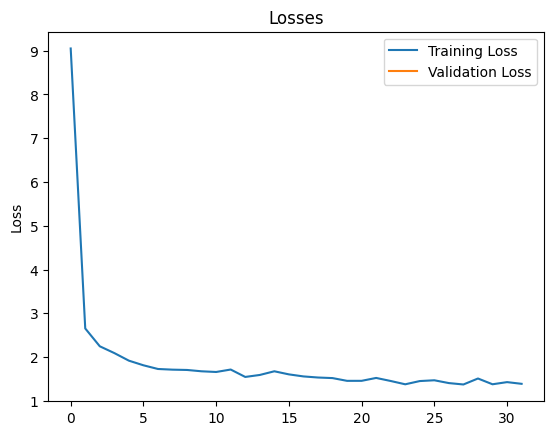

# Pluto


Pluto is a series of small language models with 1M, 15M and 30M parameters based on decoder-only transformer architecture similar to GPT-2 pre-trainded on the synthetically generated [TinyStories](https://huggingface.co/datasets/roneneldan/TinyStories) dataset.  

## Aim

**This project aims to**:

- Promote building coherent and fluent small language models by students and individuals (with access to gpus ofc!).
- Attempt to reproduce the contents of the [TinyStories paper](https://arxiv.org/pdf/2305.07759.pdf).
- Implement keeping only the top 8k most occuring tokens from our vocabulary instead of the usual 50k `vocab_size` that instead comes with the `EleutherAI/gpt-neo-125M` tokenizer.

**File structure**:

- [`model.py`](models/model.py) includes the `GPT2` transformer model architecture.
- [`tokenizer.py`](models/tokenizer.py) includes a simple class to load our `Tokenizer` object with an option to load only the top-k tokens from our vocabulary.
- [`train.py`](models/train.py) includes the `Trainer` object to train the model.
- [`demos`](demos) includes notebooks for inference and training the model.
- root folder also includes [`training.py`](training.py) & [`inference.py`](inference.py) to run locally.

Support functions like `plot_lossess` and `estimate_loss` for the training phase are in [`utils.py`](models/utils.py). If you want to see more generations from the models, see [`examples.py`](examples.py).

> [!NOTE]
> The details for pluto-30M model will be added shortly.

# Usage


# Preprocessing

**Note from the paper**:
> We use GPT-Neo tokenizer but only keep the top 10K most
common tokens.

Our `Tokenizer` object includes an optional `k` parameter that we can set to any number to include only the top-k tokens in our vocabulary. The `roneneldan/TinyStories` dataset contains around 476.6M total tokens and 475.5M tokens if we take top-8k most occuring tokens. Which is pretty neat! 

This means around 42257/50256 tokens do not even occur that much in our dataset to make a huge difference, so we might as well remove them. As you will see this makes no significant effect on the quality of the model, only reducing the size significantly!

**Getting Top K tokens**

This repo includes a [tokens.json](tokens.json) file, which just includes the token appearance count of each token in our vocabluary. Eg - If the token "and" appeared 5 times in our whole dataset, it would be `{"and":5}` in tokesn.json.

**Replacing the tokens**

Finally our `Tokenizer` object takes in the orignal `EleutherAI/gpt-neo-125M` encoder, encodes one batch, maps out the tokens in the tensor to our tokens.json dict, and simply replaces them in a gpu efficient manner.
```
 if self.k:
      tokens = torch.tensor([self.top_k_tokens_dict.get(str(token.item()), self.top_k_tokens_dict["50256"]) for token in tokens.view(-1)], device=self.device).view(tokens.shape)
```

Now that the tough part is out of the way, let's transform!


# Models
 Model sizes, Architecture and hyperparameters :
 
| *n*<sub>params</sub>    | *n*<sub>layers</sub> |*d*<sub>model</sub> |*n*<sub>heads</sub> | *d*<sub>head</sub> | Batch Size | Learning Rate
| ------------- | ------------- |------------- |------------- |------------- |------------- |------------- |
| 1.5M  | 8  | 64  | 16 | 4 | 64 | 2e-3
| 15M  | 8  | 320 | 16 | 20 | 90 | 2e-3

All models use a `context_size` or `block_size` of 256, `max_pos_embed` of 2048 and dropout of 0.2. Trained on 1.2M/2.1M examples in the dataset for 1 epoch.


# Training
All training was done on one V100 GPU. Both models took roughly 1.5hrs to train for 1 epoch on 1.2M examples and cost around $12 only.

 - pluto-15M achieves Steps: 4600 | Train loss: 1.3880 | Val loss: 1.2916 
 - pluto-1M achieves  Steps: 12500 | Train loss: 1.8176 | Val loss: 1.7087

Loss curve for pluto-15M




> [!IMPORTANT]
> Training hyperparameters were kept low on purpose. Keeping problems such as GPU constraints, costs and lack of high-quality data students/indivisuals might face in mind. As this project aims to promote building SLMs and not achieve perfection.


# Results

***pluto-15M (prompt=Elon the boy)***: "Elon the boy loved to play with his toys in his room. He had cars, dolls and books. He liked to share them with his friends, but he always wanted more.One day, he saw a big red car on the shelf. It was red and shiny. He wanted to go on it, but he did not know how to go. He asked his mom for the car to push him to the top of the hill.Sure, I will try to reverse your car, he said. He pushed his bike up the stairs and started the car. He pushed and pushed and the car moved. He felt happy.But then, a big car came out. It had a loud engine that made a loud noise. It was the cars car. It was going too fast and fast. It hit a lamp. It was a car. The car hit the lamp. It was broken.Freddy felt sad. He could not move his car. He liked it.
"

***pluto-15M (uncondtional)***: "one day, a little girl named Lily wanted to go for a walk. She asked her mom if she could go to the park. Her mom said, Yes, but first we have to go to the park. It will be fun.Lily was very excited and ran to the park. She saw a big slide and wanted to go down it. She asked her mom if she could go up the slide. Her mom said yes, and Lily climbed up the slide.Lily was so happy and started to slide. She went up the slide and felt happy. She wanted to be like the slide too. When she got home, she sat down and started to slide down. She felt so happy.As she got to the bottom, she saw her friend Tom. She was also very good at sliding. She wanted to slide too. Lily was very good at sliding down. She slid down the slide and slid down the slide. She had so much fun and forgot all about the slide"

***pluto-1M (prompt=One day lily)***: "One day lily and her mom took her to the park. They liked the swings, the swings, swing and the sandbox. But one day, they saw a big dog on the swings. The dog was very big, brown. Lily wanted to play in the park but she ran back to him, but the dog was too close. He ran around the park, but he was not afraid. Lily and her mom walked away, but their mom did not. She was not happy. They ran to the big dog and saw their mom. They wanted to play on the swings in the park, but they could not find the dog. They looked sad and worried. They looked at each other. Then, they saw a big tree with lots of branches on the ground. Lily and her mom said, Lily, can we get the fence. We dont know if we do it.Mom said, Yes, but only if we do something else. You can play too"

**pluto-1M (unconditonal)**: "was a little boy who loved to eat lunch. His mom gave him a bowl of cheese and some cheese. The cheese was very tasty and ate. The little boy loved to play with his cheese and share the cheese with his family. The little boy ate his cheese with his mouth and he loved the cheese.One day, the little boy went to a new place to play with his cheese. The big dog liked to play with his food. He saw a big dog with a bone and a black bear. The little boy and the dog played with the cheese all day. The little boy was very happy and happy."


# Conclusion
The effectiveness of small models trained on curated synthetic datasets is well documented by TinyStories, Textbooks is all you need I & II, etc.

Strongly believe that SLMs trained on quality data will be highly valuable and economical in education & domain specific tasks.

> [!TIP]
> @tunguz on X: In my experience figuring out which data *NOT* to use has far more value than just getting a crapload more data.

# Refrences
### Code
- **TinyStories-33M**: https://huggingface.co/roneneldan/TinyStories-33M
- **TinyStories**: https://huggingface.co/datasets/roneneldan/TinyStories
- **Andrej karpathy's minGPT**: https://github.com/karpathy/minGPT
- **GPT-2**: https://github.com/openai/gpt-2
- **gpt-tinystories**: https://github.com/raymond-van/gpt-tinystories

### Papers
- **TinyStories: How Small Can Language Models Be and Still Speak
Coherent English?** : https://arxiv.org/pdf/2305.07759.pdf
- **Language Models are Unsupervised Multitask Learners**: https://d4mucfpksywv.cloudfront.net/better-language-models/language-models.pdf
- **Textbooks Are All You Need II: phi-1.5**: https://arxiv.org/pdf/2309.05463.pdf#page14
- **Textbooks Are All You Need**: https://arxiv.org/pdf/2306.11644.pdf


Happy Transforming!